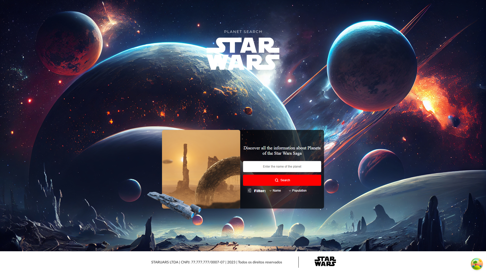
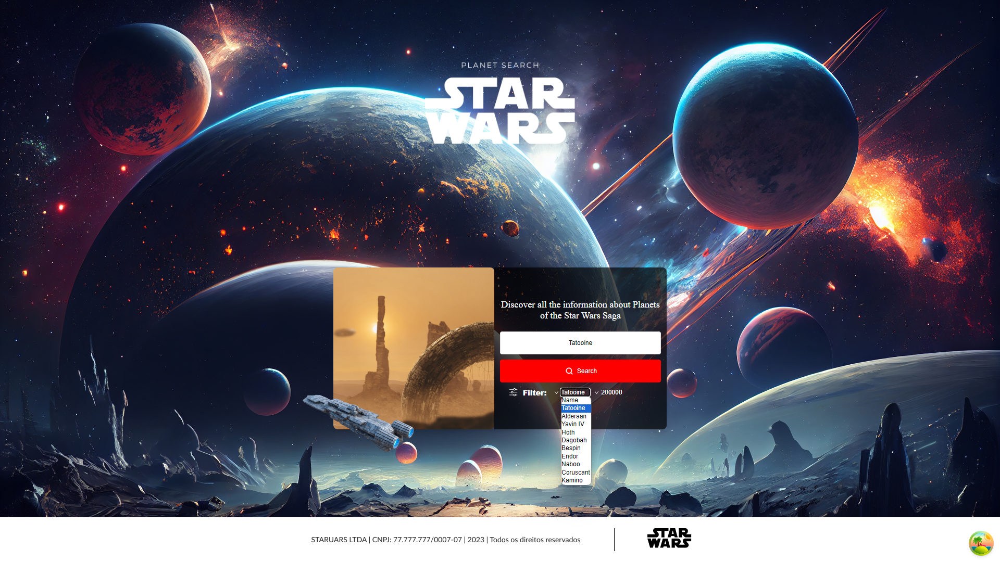
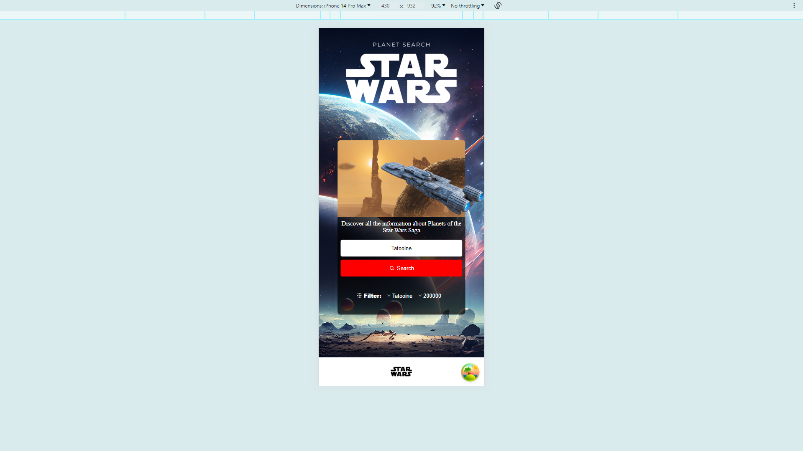
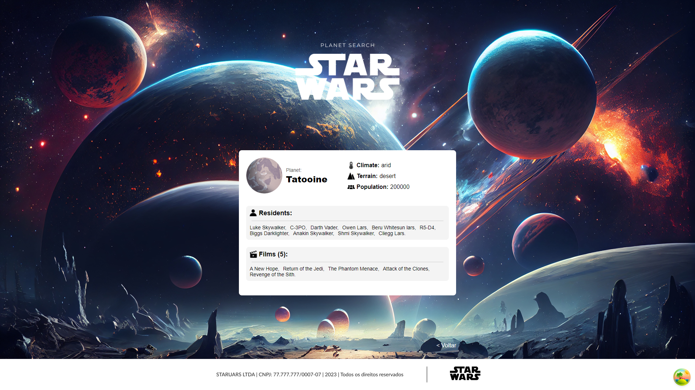
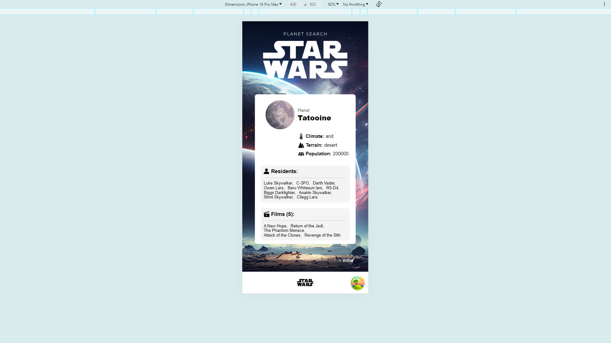
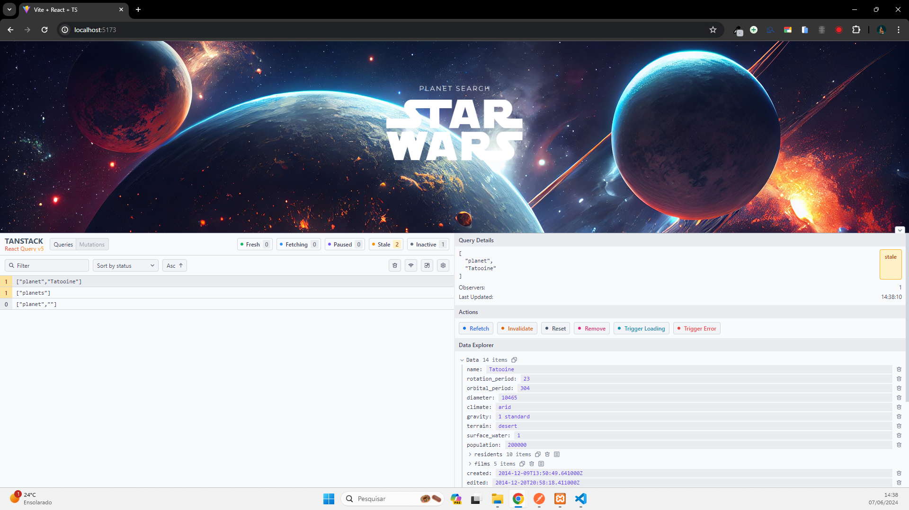

<div align="center" id="top"> 
  

&#xa0;

</div>

<h1 align="center">Star Wars Planets</h1>

<!-- Status -->

<!-- <h4 align="center">
	🚧  Star Wars Planets 🚀 Under construction...  🚧
</h4>

<hr> -->

<p align="center">
  <a href="#dart-about">About</a> &#xa0; | &#xa0; 
  <a href="#sparkles-features">Features</a> &#xa0; | &#xa0;
  <a href="#rocket-technologies">Technologies</a> &#xa0; | &#xa0;
  <a href="#white_check_mark-requirements">Requirements</a> &#xa0; | &#xa0;
  <a href="#checkered_flag-starting">Starting</a> &#xa0; | &#xa0;
  <a href="#memo-license">License</a> &#xa0; | &#xa0;
  <a href="https://github.com/RafaelMartini" target="_blank">Author</a>
</p>

<br>

## :dart: About

O Star Wars Planets foi criado para mostrar os planetas da saga Star Wars, baseado nos filtros podemos saber a população e região, ver o planeta, divirta-se pesquisando..

<div align="center" id="top"> 
  
  
  
  
  
  

</div>

## :sparkles: Features

:heavy_check_mark: **Feature 1: Tela de Carregamento Inicial**  
Exibição da logo da InnovateTech enquanto o aplicativo carrega.

:heavy_check_mark: **Feature 2: Listagem Paginada de Alunos**  
Exibição dos alunos com uma paginação que carrega 20 alunos por vez, com carregamento adicional ao atingir o final da lista.

:heavy_check_mark: **Feature 3: Filtragem de Alunos**  
Funcionalidade de pesquisa que permite filtrar alunos pelo primeiro ou segundo nome através de uma barra de busca.

:heavy_check_mark: **Feature 4: Visualização Detalhada de Alunos**  
Ao selecionar um aluno, um modal deve ser aberto mostrando detalhes como imagem, nome completo, email, gênero, data de nascimento, telefone, nacionalidade, endereço e ID.

:heavy_check_mark: **Feature 5: Filtro por Gênero**  
Um filtro adicional na listagem para selecionar alunos por gênero.

:heavy_check_mark: **Feature 6: Cache de Dados**  
Após o primeiro carregamento dos dados, armazenar as informações no cache interno do dispositivo para acesso rápido sem necessidade de nova consulta à API em reinicializações subsequentes.

:heavy_check_mark: **Feature 7: Gerenciamento de Estado**  
Uso do Redux para manejar o estado global da aplicação.

:heavy_check_mark: **Feature 8: Botão de subir a lista**  
Criei um botão para subir o FlatList sem precisar dr scrool para cima, com 1 click o usuário chega ao topo da lista.

:heavy_check_mark: **Feature 9: Thema Dark e Ligth**  
Para melhorar a experiência do usuário e melhorar a visibilidade em ambientes escuros, criei um botão superior lateral para mudar para thema claro e escuro.

:heavy_check_mark: **Feature 10: Tradução de inglês para português**  
Traduzi o tudo o que vinha de inglês do endpoint para português dinamicamente.

## :rocket: Technologies

The following tools were used in this project:

- [React](https://pt-br.reactjs.org/)
- [TypeScript](https://www.typescriptlang.org/)

## :white_check_mark: Requirements

Before starting :checkered_flag:, you need to have [Git](https://git-scm.com) and [Node](https://nodejs.org/en/) installed.

## :checkered_flag: Starting

```bash
# Clone o projeto
$ git clone https://github.com/RafaelMartini/star-wars-planets

# Acesse a pasta star-wars-planets
$ cd star-wars-planets

# Instale as dependências
$ npm install

# Rode o projeto
$ npm run dev

# Use a porta <http://localhost:5173/> para acessar via webpage no navegador


```

## :memo: License

This project is under license from MIT. For more details, see the [LICENSE](LICENSE.md) file.

Made with :heart: by <a href="https://github.com/RafaelMartini" target="_blank">Rafael Martini</a>

&#xa0;

<a href="#top">Back to top</a>
